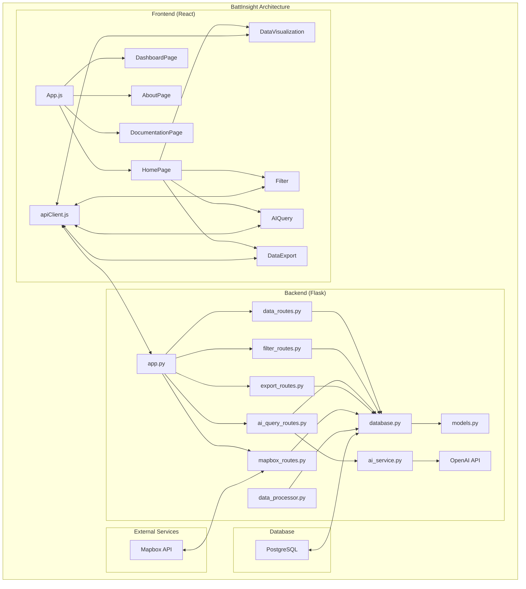

```mermaid
graph TD
    subgraph "BattInsight Architecture"
        subgraph "Frontend (React)"
            A[App.js] --> B[HomePage]
            A --> C[DashboardPage]
            A --> D[AboutPage]
            A --> E[DocumentationPage]
            
            B --> F[DataVisualization]
            B --> G[Filter]
            B --> H[AIQuery]
            B --> I[DataExport]
            
            J[apiClient.js] <--> F
            J <--> G
            J <--> H
            J <--> I
        end
        
        subgraph "Backend (Flask)"
            K[app.py] --> L[data_routes.py]
            K --> M[filter_routes.py]
            K --> N[ai_query_routes.py]
            K --> O[export_routes.py]
            K --> P[mapbox_routes.py]
            
            L --> Q[database.py]
            M --> Q
            N --> Q
            O --> Q
            P --> Q
            
            Q --> R[models.py]
            
            S[data_processor.py] --> Q
            T[ai_service.py] --> U[OpenAI API]
            N --> T
        end
        
        subgraph "Database"
            V[PostgreSQL] <--> Q
        end
        
        subgraph "External Services"
            U
            W[Mapbox API] <--> P
        end
        
        J <--> K
    end
```
