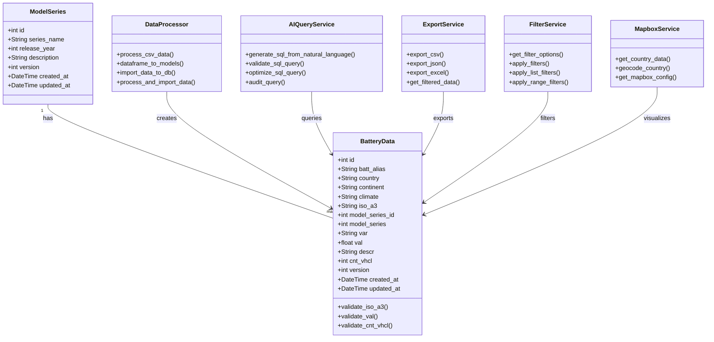

```mermaid
classDiagram
    class BatteryData {
        +int id
        +String batt_alias
        +String country
        +String continent
        +String climate
        +String iso_a3
        +int model_series_id
        +int model_series
        +String var
        +float val
        +String descr
        +int cnt_vhcl
        +int version
        +DateTime created_at
        +DateTime updated_at
        +validate_iso_a3()
        +validate_val()
        +validate_cnt_vhcl()
    }
    
    class ModelSeries {
        +int id
        +String series_name
        +int release_year
        +String description
        +int version
        +DateTime created_at
        +DateTime updated_at
    }
    
    class DataProcessor {
        +process_csv_data()
        +dataframe_to_models()
        +import_data_to_db()
        +process_and_import_data()
    }
    
    class AIQueryService {
        +generate_sql_from_natural_language()
        +validate_sql_query()
        +optimize_sql_query()
        +audit_query()
    }
    
    class ExportService {
        +export_csv()
        +export_json()
        +export_excel()
        +get_filtered_data()
    }
    
    class FilterService {
        +get_filter_options()
        +apply_filters()
        +apply_list_filters()
        +apply_range_filters()
    }
    
    class MapboxService {
        +get_country_data()
        +geocode_country()
        +get_mapbox_config()
    }
    
    ModelSeries "1" -- "many" BatteryData : has
    DataProcessor --> BatteryData : creates
    AIQueryService --> BatteryData : queries
    ExportService --> BatteryData : exports
    FilterService --> BatteryData : filters
    MapboxService --> BatteryData : visualizes
```
