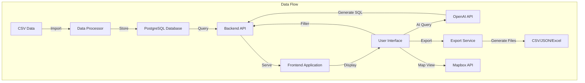

```mermaid
flowchart TD
    subgraph "Data Flow"
        A[CSV Data] -->|Import| B[Data Processor]
        B -->|Store| C[PostgreSQL Database]
        C -->|Query| D[Backend API]
        D -->|Serve| E[Frontend Application]
        E -->|Display| F[User Interface]
        F -->|Filter| D
        F -->|AI Query| G[OpenAI API]
        G -->|Generate SQL| D
        F -->|Export| H[Export Service]
        H -->|Generate Files| I[CSV/JSON/Excel]
        F -->|Map View| J[Mapbox API]
    end
```
