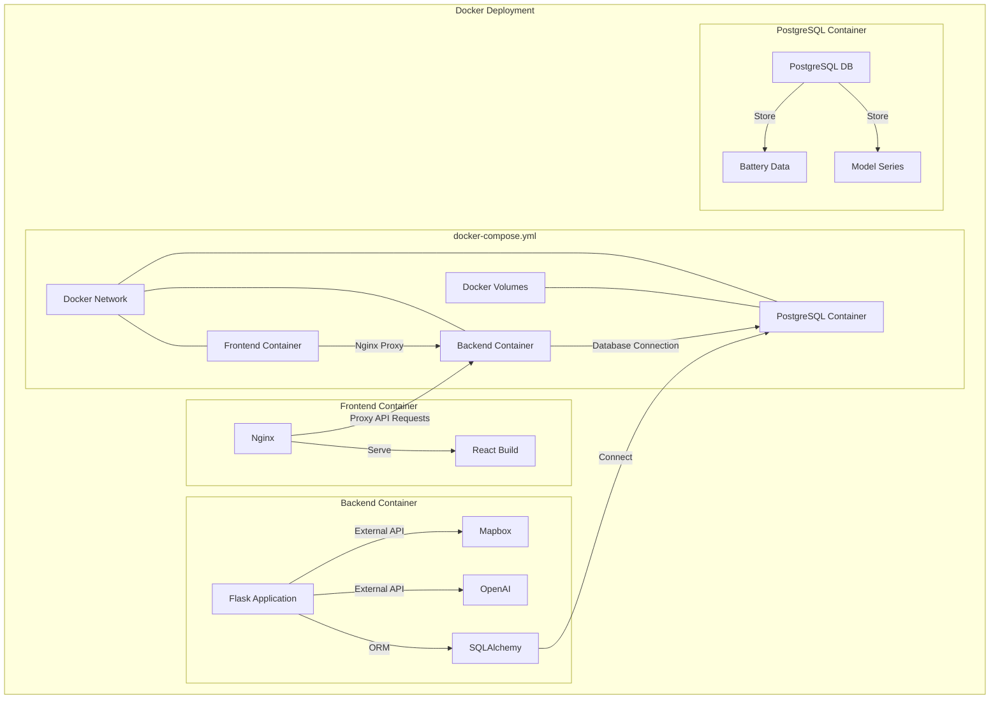

```mermaid
graph TD
    subgraph "Docker Deployment"
        subgraph "docker-compose.yml"
            A[Frontend Container] -->|Nginx Proxy| B[Backend Container]
            B -->|Database Connection| C[PostgreSQL Container]
            D[Docker Network] --- A
            D --- B
            D --- C
            E[Docker Volumes] --- C
        end
        
        subgraph "Frontend Container"
            F[Nginx] -->|Serve| G[React Build]
            F -->|Proxy API Requests| B
        end
        
        subgraph "Backend Container"
            H[Flask Application] -->|ORM| I[SQLAlchemy]
            I -->|Connect| C
            H -->|External API| J[OpenAI]
            H -->|External API| K[Mapbox]
        end
        
        subgraph "PostgreSQL Container"
            L[PostgreSQL DB] -->|Store| M[Battery Data]
            L -->|Store| N[Model Series]
        end
    end
```
